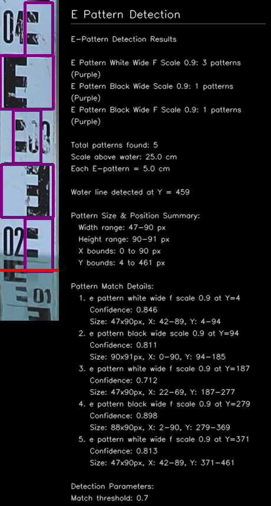
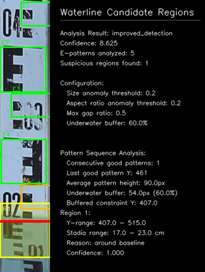
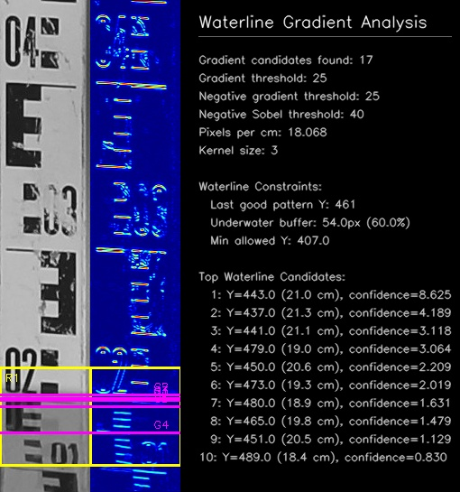
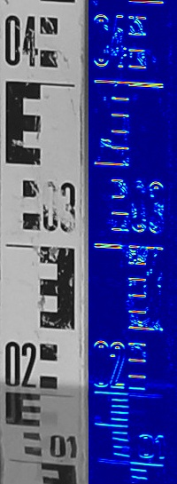
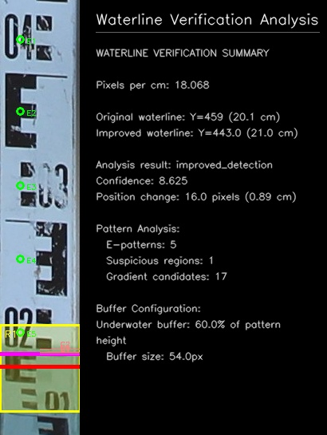

# Water Level Measurement System - Pattern-Aware Approach

*Advanced water level detection for scales with complex markings and patterns*

> Disclaimer: This work is part of a non-funded prototype research idea conducted at the [SenseLAB](http://senselab.tuc.gr/) of the [Technical University of Crete](https://www.tuc.gr/el/archi).

[](https://opensource.org/licenses/BSD-3-Clause)
[](https://www.python.org/downloads/)
[](https://opencv.org/)
[](https://github.com/)

## Table of Contents

- [Overview](#overview)
- [Features](#features)
- [Quick Start Guide](#quick-start-guide)
- [Installation](#installation)
- [Configuration](#configuration)
- [Pattern Detection Guide](#pattern-detection-guide)
  - [E-Pattern Sequential Detection](#e-pattern-sequential-detection)
  - [Template Management](#template-management)
- [Detection Methods](#detection-methods)
- [Troubleshooting](#troubleshooting)
- [Development](#development)
  - [Architecture Overview](#architecture-overview)
  - [Detection Flow Architecture](#detection-flow-architecture)
  - [Key Classes](#key-classes)

## Overview

The pattern-aware system provides specialized water level detection by using pattern recognition to identify repetitive scale markings (such as E-patterns on stadia rods) above the water surface. It leverages the key observation that scale patterns underwater appear distorted due to refraction and optical effects, while patterns above water remain clear and detectable.

**Key Innovation:** Instead of trying to detect the water interface directly, this system locates repetitive, non-distorted scale markings above the water line and calculates the water level based on the position of the lowest detectable pattern. This approach significantly reduces erroneous waterline detections caused by scale markings, reflections, or visual noise.

## Features

**Core Capabilities:**

- **E-Pattern Sequential Detection** - Finds repetitive E-shaped markings above water (5cm graduations)
- **Pattern Recognition Above Water** - Identifies clear, undistorted scale markings on a scale above water
- **Distortion-Based Water Level Inference** - Uses pattern distortion to determine water boundary

**Advanced Features:**

- **Scale-Specific Adaptation** - Adapts detection parameters to individual scale characteristics
- **Confidence Scoring** - Provides detailed reliability metrics for all detections
- **Comprehensive Logging** - Detailed pattern analysis and decision process tracking
- **Debug Visualization** - Pattern analysis debugging framework

## Quick Start Guide

### Step 1: Enable Pattern-Aware Detection

**Environment Variable Method (Recommended):**

```bash
# Windows Command Prompt
set PATTERN_AWARE_MODE=true
python src_pattern_aware/main_pattern_aware.py

# Linux/Mac
export PATTERN_AWARE_MODE=true
python src_pattern_aware/main_pattern_aware.py
```

**Configuration File Method:**

```yaml
# In config.yaml
pattern_processing:
  mode: 'pattern_aware'  # Options: 'standard', 'pattern_aware', 'hybrid'

detection:
  pattern_aware:
    engine: 'integrated_pattern'
    fallback_to_standard: true
    
    e_pattern_detection:
      enabled: true
      single_e_cm: 5.0                # Each E-pattern represents 5cm
      match_threshold: 0.7           
      max_consecutive_failures: 6
```

### Step 2: Extract E-Pattern Templates

```bash
# Interactive template extraction tool
python src_pattern_aware/interactive_template_extractor.py
```

**Follow the prompts:**

1. Select template type (E_pattern_black or E_pattern_white)
2. Click on clear E-shaped markings in the image
3. Templates are automatically saved for reuse

### Step 3: Run Detection

```bash
# Pattern-aware detection
python src_pattern_aware/main_pattern_aware.py

# Hybrid mode (runs both standard and pattern-aware)
set PATTERN_AWARE_MODE=hybrid
python src_pattern_aware/main_pattern_aware.py
```

### Expected Results

```
INFO - Starting Pattern-Aware Water Level Detection System
INFO - Loading E-pattern templates: 2 templates loaded
INFO - Processing IMG_0154.JPG...
INFO - E-pattern detection: Found 8 clear patterns above water surface
INFO - Underwater patterns: Distorted/undetectable (indicating water boundary)
INFO - Scale measurement: 8 E-patterns × 5cm = 40cm above water
INFO - Pattern-aware detection: 44.55cm (confidence: 0.950)
INFO - Standard detection: 42.1cm (confidence: 0.886)
INFO - Selected pattern-aware result (higher confidence)
```

## Installation

The pattern-aware system uses the same dependencies as the standard system:

```bash
# Install dependencies
pip install -r requirements.txt

# Create pattern template directories
mkdir -p data/pattern_templates/scale_markings
mkdir -p data/debug/pattern_analysis

# Verify installation
python -c "from src_pattern_aware.pattern_water_detector import PatternWaterDetector; print('Pattern-aware system ready')"
```

## Configuration

### Pattern-Aware Settings

```yaml
detection:
  pattern_aware:
    engine: 'integrated_pattern'      # Pattern detection engine
    fallback_to_standard: true        # Fall back to standard methods if needed
    
    # E-pattern sequential detection
    e_pattern_detection:
      enabled: true                   
      single_e_cm: 5.0                # Each E-pattern represents 5cm
      match_threshold: 0.7            # Template matching threshold
      max_consecutive_failures: 6     # Stop after N failures (water reached)
      support_flipped: false          # Support 180-degree flipped patterns
    
    # Template matching settings
    template_matching:
      enabled: true
      threshold: 0.75                 # Template match confidence
      max_templates: 10               # Maximum templates to store
      template_source: 'manager'      # Options: 'local', 'manager', 'both'
      use_default_templates: true     # Create default stadia rod templates
      
      # Advanced template matching preprocessing
      preprocessing:
        mean_shift_filtering: true      # Apply mean shift filtering for noise reduction
        adaptive_thresholding: true     # Use adaptive thresholding for better contrast
        morphological_cleaning: true    # Apply morphological operations
      
      # Non-Maximum Suppression for overlapping detections
      nms:
        enabled: true                   # Enable Non-Maximum Suppression
        threshold: 0.4                  # NMS overlap threshold
        confidence_threshold: 0.5       # Minimum confidence for NMS
      
      # Template-specific thresholds (override global threshold)
      template_thresholds:
        e_major: 0.6                    # E-pattern major graduations
        line_minor: 0.7                 # Simple line minor graduations
        line_thick: 0.65                # Thick line intermediate graduations
        number_marking: 0.5             # Number markings on rod
        l_major: 0.6                    # L-shaped major graduations
    
    # Additional detection methods
    morphological:
      enabled: true
      horizontal_kernel_size: [40, 1]   # Horizontal feature detection
      vertical_kernel_size: [1, 40]     # Vertical feature suppression
    
    frequency_analysis:
      enabled: true
      periodicity_threshold: 0.3        # Max periodicity for water interface
    
    line_detection:
      enabled: true
      min_line_length_ratio: 0.6        # Minimum line length (% of scale width)
      max_angle_deviation: 10           # Max angle from horizontal (degrees)
    
    contour_analysis:
      enabled: true
      min_aspect_ratio: 10              # Minimum width/height ratio
      min_width_ratio: 0.5              # Minimum width (% of scale width)
    
    # Hybrid waterline verification system
    waterline_verification:
      enabled: true                     # Enable hybrid waterline verification
      enable_fallback_regions: false   # Enable extended regions below primary region
      min_pattern_confidence: 0.7      # Minimum confidence for waterline detection
      gradient_kernel_size: 3          # Sobel kernel size for gradient analysis
      gradient_threshold: 25           # Threshold for significant gradient changes
      negative_gradient_threshold: 25  # Negative gradient differentials threshold
      negative_sobel_threshold: 40     # Blue signature detection threshold
      
      # Pattern analysis thresholds
      pattern_analysis:
        # Consecutive pattern detection
        scale_consistency_threshold: 0.15    # Scale factor consistency (±15%)
        size_consistency_threshold: 0.15     # Size consistency (±15%) 
        spacing_consistency_threshold: 0.10  # Spacing consistency (±10%)
        min_consecutive_patterns: 0          # Minimum consecutive patterns required
        
        # Anomaly detection thresholds
        scale_anomaly_threshold: 0.20        # Scale factor change for suspicious regions
        size_anomaly_threshold: 0.20         # Size change for suspicious regions
        aspect_ratio_anomaly_threshold: 0.20 # Aspect ratio change for suspicious regions
        max_gap_ratio: 0.5                   # Max gap between patterns
        
        # Baseline buffer - symmetric coverage around last detected pattern
        baseline_buffer_percentage: 0.6      # Buffer as % of avg pattern height
      
      # Candidate clustering for improved selection
      candidate_clustering:
        enabled: true                   
        cluster_height_cm: 5.0          # Height of clustering region in cm
        min_candidates_in_cluster: 2    # Minimum candidates to form cluster
        use_median_selection: false     # Use highest confidence vs median position
        max_cluster_centers: 10         # Maximum cluster centers to evaluate

pattern_processing:
  mode: 'pattern_aware'               # Options: 'standard', 'pattern_aware', 'hybrid'
  debug_patterns: true                # Save pattern analysis debug images
  save_templates: true                # Save extracted templates for reuse
  template_directory: 'data/pattern_templates/scale_markings'
```

## Pattern Detection Guide

### E-Pattern Sequential Detection

The E-pattern detector uses scale-invariant template matching to find repetitive E-shaped markings above water:

```python
from src_pattern_aware.detection_methods.e_pattern_detector import EPatternDetector

# Detector automatically loads templates from data/pattern_templates/scale_markings/
detector = EPatternDetector(config, calibration_data)

# Scale-invariant detection with multi-scale template matching  
result = detector.detect_patterns(image, scale_region)
print(f"Template variants tested: {detector.get_template_count()}")  # 44 total (11 scales × 2 orientations × 2 patterns)
print(f"Clear patterns above water: {result['patterns_above_water']}")
print(f"Scale above water: {result['scale_above_water_cm']}cm")
```

**Key Features:**

- **Multi-scale matching**: Tests 11 scale factors (0.3x to 2.0x) to find patterns at natural size
- **Orientation support**: Detects normal and 180° flipped patterns
- **Sequential scanning**: 2-pixel step size from top to bottom until consecutive failures
- **Shape-only recognition**: No size constraints - templates adapt to natural pattern size

### Template Management

The system supports multiple approaches for managing E-pattern templates:

**Direct Template Placement (Easiest Method)**

```bash
# Create custom template images and place them directly:
data/pattern_templates/scale_markings/
├── e_template_black_[timestamp].png    # Your black E-pattern template
├── e_template_white_[timestamp].png    # Your white E-pattern template
├── custom_marking_[name].png           # Any custom marking template
└── [any_filename].png                  # System auto-detects all templates
```

**Template Requirements:**

- **Size**: Any size (system scales automatically for matching)
- **Format**: PNG, JPG, JPEG, BMP, TIFF supported
- **Content**: Clear, undistorted patterns from above-water regions
- **Naming**: Any filename (timestamp format optional for organization)

**Manual Template Extraction Tools**

```bash
# Interactive extraction from calibration images
python src_pattern_aware/interactive_template_extractor.py

# Batch processing (if available)
python src_pattern_aware/extract_templates.py --scale-type stadia_rod
```

## Detection Methods

### E-Pattern Sequential Detector

- **Implementation**: Scale-invariant template matching with multi-scale testing
- **Templates**: 44 variants per base template (11 scales × 2 orientations × 2 patterns)
- **Scanning**: Top-to-bottom with 2-pixel steps, stops at consecutive failures (default: 10)
- **Measurement**: Each detected E-pattern = 5cm, water level calculated from pattern count
- **Stopping Logic**: Pattern visibility indicates water boundary - distorted patterns mark submersion

### Hybrid Waterline Analyzer

- **Trigger**: Automatically applied when ≥2 E-patterns detected successfully
- **Method**: Y-axis gradient analysis below last detected pattern using Sobel operators

**Waterline Region Calculation Process**:

1. **Consecutive Pattern Validation** - Establish baseline from consistent patterns:
   - Analyze detected E-patterns for scale, size, and spacing consistency
   - Apply thresholds: scale (±15%), size (±15%), spacing (±10%)
   - Identify last valid E-pattern that meets consecutive pattern criteria

2. **Baseline Reference Point Establishment**:
   - Calculate bottom of last valid E-pattern: `reference_y = pattern_center_y + (pattern_height / 2)`
   - This becomes the baseline for waterline search regions

3. **Symmetric Buffer Region Creation**:
   - Calculate buffer size: `buffer_pixels = average_pattern_height × baseline_buffer_percentage (0.6)`
   - Primary search region: `[reference_y - buffer_pixels, reference_y + buffer_pixels]`
   - Provides symmetric coverage above/below the pattern bottom (60% of pattern height each direction)

4. **Extended Region Generation** (if enabled):
   - Create additional systematic scan regions extending downward from primary region
   - Each region height: configurable (default: 20 pixels)
   - Regions continue until scale boundary or maximum scan depth reached

5. **Y-Axis Gradient Analysis**:
   - Apply Sobel operators for vertical gradient detection within each region
   - Combined metric detection: Blue signature + gradient differentials + edge magnitude
   - Generate waterline candidates with confidence scores

6. **Candidate Clustering**:
   - Group candidates within 5cm height regions using density-based clustering
   - Select best candidate from highest-density cluster
   - Cross-validate with original E-pattern water level calculation

**Key Innovation**: Uses bottom of last detectable E-pattern as physical reference point for waterline search, ensuring search occurs in the correct location where patterns transition from clear (above water) to distorted (underwater).

### Integrated Detector Priority Chain

1. **E-Pattern Sequential** (highest priority) - Scale-invariant pattern matching
2. **Hybrid Waterline Analysis** - Post-processing gradient validation
3. **Template Matching** (fallback) - General pattern suppression
4. **Morphological Detection** (fallback) - Horizontal vs vertical separation
5. **Standard Detection** (final fallback) - Color/edge-based methods

### Combined Metric Waterline Detection

- **Blue Signature Detection**: Raw negative Sobel gradients indicate water darkness
- **Gradient Differential Analysis**: Traditional transition detection between materials
- **Edge Magnitude Assessment**: Transition sharpness for confidence scoring
- **Proportional Scoring**: Stronger signals contribute more to final confidence

## Troubleshooting

### Common Issues

**Low Detection Confidence:**

```yaml
# Adjust detection thresholds
detection:
  pattern_aware:
    e_pattern_detection:
      match_threshold: 0.6  # Lower threshold (was 0.7)
    template_matching:
      threshold: 0.65       # Lower threshold (was 0.75)
```

**Pattern-Aware vs Standard Results Differ:**

```yaml
# Enable hybrid mode for comparison
pattern_processing:
  mode: 'hybrid'
  
# Check debug images
debug:
  enabled: true
  save_debug_images: true
  steps_to_save:
    - 'pattern_e_pattern_result'
    - 'waterline_verification_analysis'
```

### Debug Analysis

**Enable Pattern Debug Images:**

```yaml
debug:
  steps_to_save:
    - 'pattern_e_pattern_result'          # E-pattern detection results
    - 'pattern_template_matching_result'  # Template matching results
    - 'waterline_verification_analysis'   # Waterline verification process
    - 'waterline_candidate_regions'      # Candidate region analysis
```

**Log Analysis:**

- Look for "E-pattern detection:" lines showing patterns found above water
- Check "Underwater patterns:" messages indicating distortion boundary
- Monitor "Scale measurement:" lines for 5cm calculations from clear patterns
- Watch for fallback messages when insufficient patterns detected above water

## Development

### Architecture Overview

```
src_pattern_aware/
├── pattern_water_detector.py          # Main pattern-aware detector coordinator
├── main_pattern_aware.py              # Entry point and orchestration
├── hybrid_detector.py                 # Hybrid mode (pattern + standard)
├── hybrid_waterline_analyzer.py       # Advanced waterline verification system
├── detection_methods/                 # Core detection algorithms
│   ├── e_pattern_detector.py         # Scale-invariant E-pattern sequential detection
│   ├── template_matching.py          # Multi-scale template matching
│   ├── morphological_detector.py     # Horizontal/vertical pattern separation
│   └── integrated_detector.py        # Detection method coordination
├── interactive_template_extractor.py  # Template extraction tool
└── utils/                            # Shared pattern analysis utilities
```

### Detection Flow Architecture

```
┌─────────────────┐    ┌──────────────────────┐    ┌─────────────────────┐
│   Image Input   │───▶│  E-Pattern Scanner   │───▶│  Pattern Validation │
│                 │    │  (Multi-scale        │    │  (Consistency       │
└─────────────────┘    │   Template Matching) │    │   Threshold Check)  │
                       └──────────────────────┘    └─────────────────────┘
                                 │                           │
                                 ▼                           ▼
┌─────────────────┐    ┌──────────────────────┐    ┌─────────────────────┐
│ Last Valid      │───▶│  Baseline Reference  │───▶│ Symmetric Buffer    │
│ E-Pattern       │    │  Point Calculation   │    │ Region Creation     │
│ Identification  │    │  (bottom of pattern) │    │ (±60% pattern height)│
└─────────────────┘    └──────────────────────┘    └─────────────────────┘
                                 │                           │
                                 ▼                           ▼
┌─────────────────┐    ┌──────────────────────┐    ┌─────────────────────┐
│ Pattern Count   │    │  Candidate Regions   │───▶│ Y-Axis Gradient     │
│ Water Level     │    │  Definition          │    │ Analysis            │
│ (5cm per pattern)│    │  (baseline + buffer) │    │ (within regions)    │
└─────────────────┘    └──────────────────────┘    └─────────────────────┘
         │                       │                           │
         ▼                       ▼                           ▼
┌─────────────────┐    ┌──────────────────────┐    ┌─────────────────────┐
│ Candidate       │───▶│  Combined Metric     │───▶│  Final Result       │
│ Clustering      │    │  Detection           │    │  Selection          │
│ (5cm regions)   │    │  (Blue signature +   │    │  (Pattern vs        │
└─────────────────┘    │   Gradient + Edge)   │    │   Hybrid vs         │
                       └──────────────────────┘    │   Fallback)         │
                                                   └─────────────────────┘
```

### Key Classes

- **PatternWaterDetector**: Main detection coordinator and entry point
- **EPatternDetector**: Scale-invariant sequential pattern detection with 44 template variants
- **HybridWaterlineAnalyzer**: Post-processing gradient analysis with combined metric detection
- **TemplateManager**: Multi-scale template generation and management
- **HybridDetector**: Orchestrates pattern-aware and standard detection comparison

## Example Processing Workflow

The following images demonstrate the complete pattern-aware detection process on a real stadia rod image, showing each major processing step from E-pattern detection to final waterline verification.

### E-Pattern Detection Results



**E-Pattern Sequential Detection**: Shows detected E-shaped patterns (green rectangles) above water surface. Each detected pattern represents 5cm of scale. The system uses multi-scale template matching to find patterns at their natural size, stopping when consecutive detection failures indicate the water boundary has been reached.

### Waterline Candidate Regions



**Candidate Region Definition**: Displays systematic scan regions (yellow overlays) extending downward from the last detected E-pattern. The primary region uses a symmetric buffer around the baseline (bottom of last valid pattern), with additional extended regions providing comprehensive coverage for waterline detection.

### Gradient Analysis Visualization



**Y-Axis Gradient Analysis**: Side-by-side comparison showing original image (left) and gradient magnitude visualization (right). Purple lines indicate detected waterline candidates within the systematic scan regions. The analysis uses vertical Sobel operators to detect horizontal transitions characteristic of waterline interfaces.

### Clean Gradient Analysis



**Gradient Analysis Clean View**: Simplified visualization of gradient-based waterline detection showing only the essential detection regions and candidate lines. This clean view emphasizes the systematic approach to candidate region coverage and gradient-based transition detection.

### Complete Verification Analysis



**Hybrid Waterline Verification**: Comprehensive analysis overlay showing E-pattern positions (green circles), systematic scan regions (yellow), gradient candidates (purple lines), and the final verified waterline position. This demonstrates the complete integration of pattern-based and gradient-based detection methods for improved accuracy.
